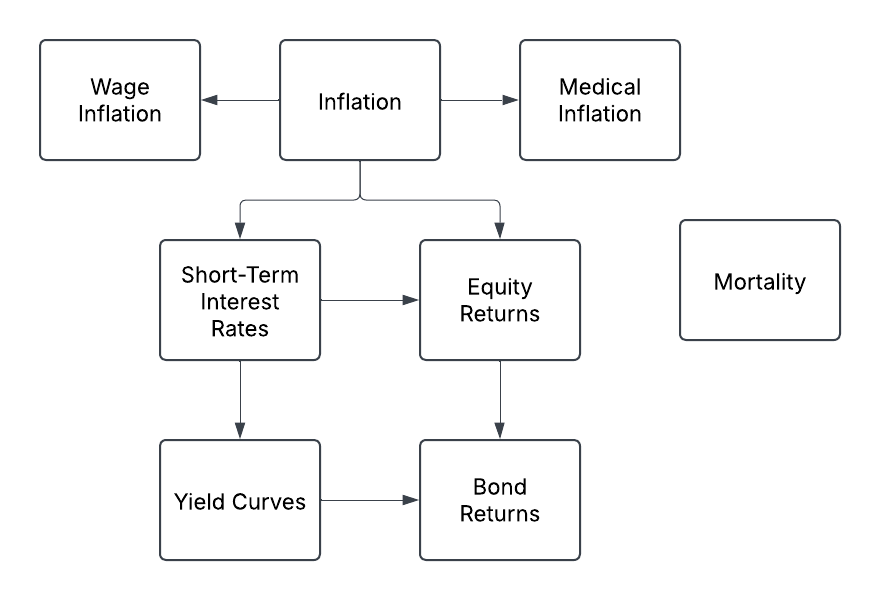
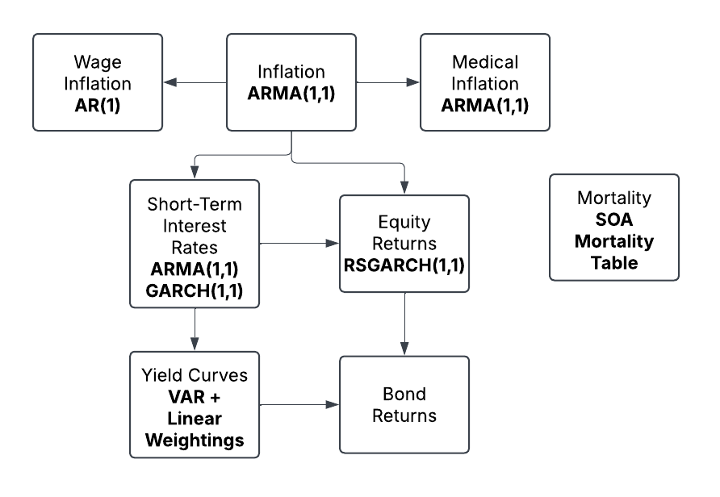
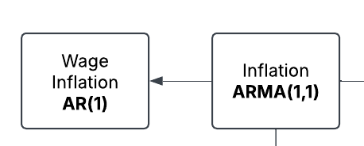
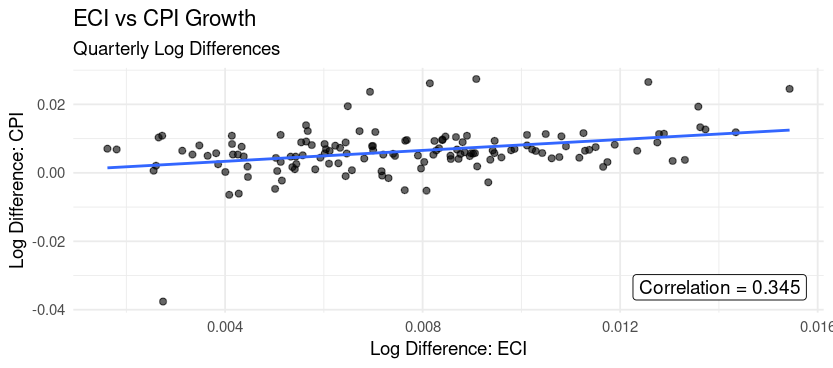
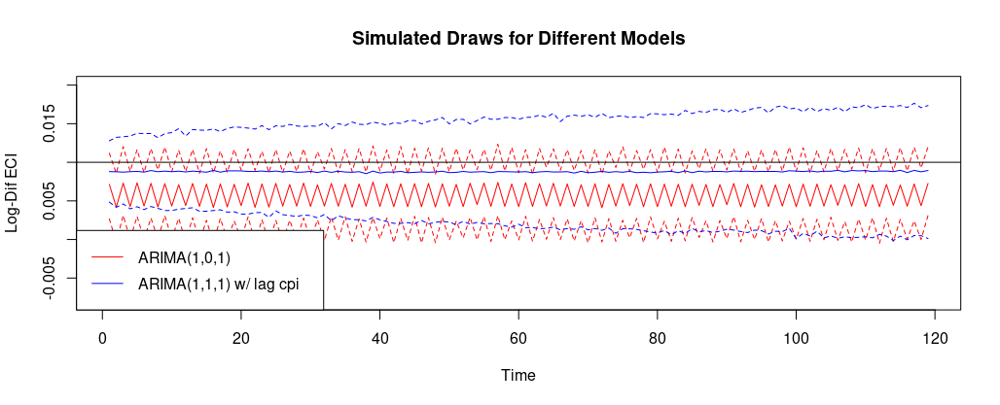
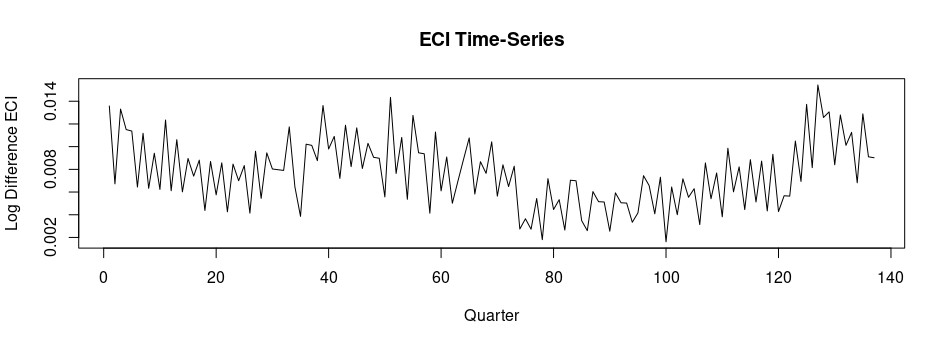
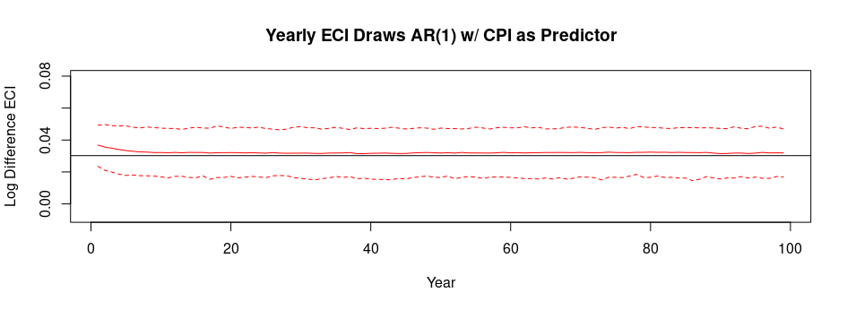
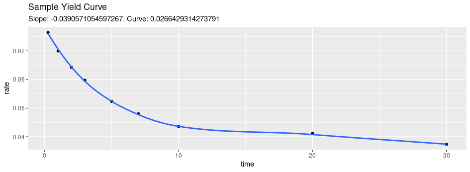
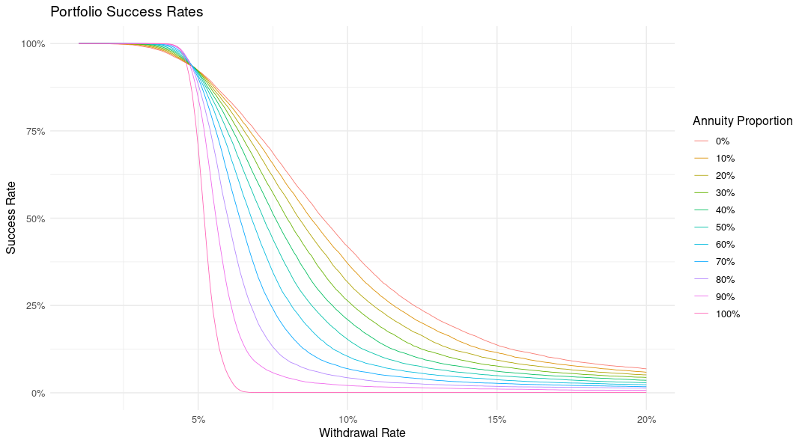
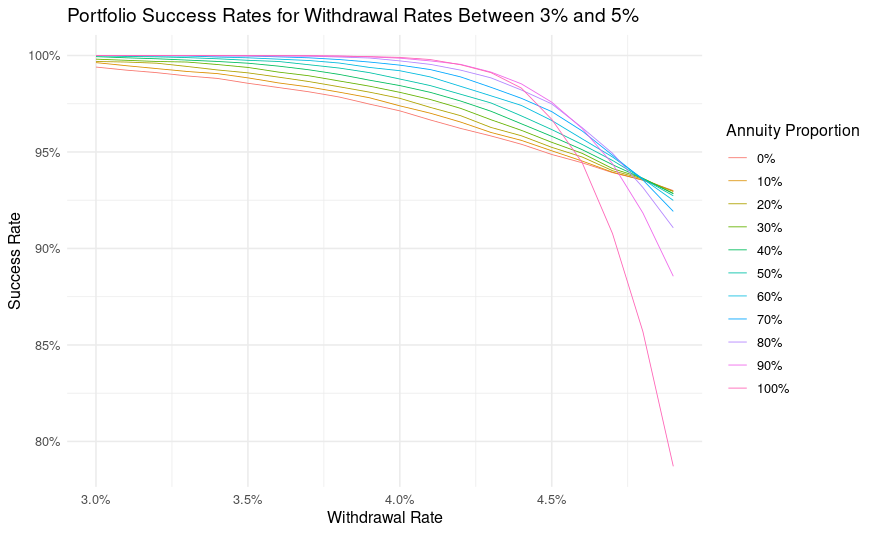

<!-- ## Planning for Retirement {background-color="#FFFAEE"} -->

<!-- ::: {.fragment .semi-fade-out} -->

<!-- **Pre-retirement:** -->

<!-- -   How much money do I need to retire? -->

<!-- -   How long will it take to save that much? -->

<!-- -   When should I retire? -->

<!-- ::: -->

<!-- **Post-retirement:** -->

<!-- -   How much can I spend in retirement? -->

<!-- -   How long will my money last? -->

<!-- -   Where should I put my assets? -->

## Retirement & Longevity Risk {background-color="#FFFAEE"}

Goal: **Minimize longevity risk**

-   Longevity Risk: The probability of running out of assets in retirement

Financial Unknowns:

::: {.fragment .fade-up}
-   Cost of Living (inflation)
-   Equity Returns
-   Medical Costs
-   End of Life Costs
-   Age of Death
:::

<!-- ## How is this risk quantified? {background-color="#FFFAEE"} -->

<!-- :::::: {.fragment .fade-out} -->

<!-- #### Deterministic approach: -->

<!-- ::::: columns -->

<!-- ::: {.column width="40%"} -->

<!-- Inflation: 2% -->

<!-- Stock Returns: 7%, 12% -->

<!-- ::: -->

<!-- ::: {.column width="60%"} -->

<!-- Withdrawal Rate: 4% (\$40,000) -->

<!-- ::: -->

<!-- ```{r, fig.width=10, fig.height=4} -->

<!-- library(tidyverse) -->

<!-- library(scales) -->

<!-- # deterministic approach -->

<!-- inflation <- 0.02 -->

<!-- stock_returns <- 0.12 -->

<!-- stock_returns2 <- .07 -->

<!-- short_term_rate <- 0.03 -->

<!-- withdrawal_amount <- 1000000 * .04 -->

<!-- # retirement savings -->

<!-- savings <- 1000000 -->

<!-- # retirement period -->

<!-- retirement_years <- 35 -->

<!-- savings_by_year <- numeric(retirement_years) -->

<!-- savings_by_year[1] <- savings -->

<!-- savings_by_year2 <- numeric(retirement_years) -->

<!-- savings_by_year2[1] <- savings -->

<!-- # simulate retirement -->

<!-- for (i in 2:retirement_years) { -->

<!--   savings_by_year[i] <- savings_by_year[i-1] - withdrawal_amount*(1+inflation) + (stock_returns * .2*savings_by_year[i-1]) -->

<!--   savings_by_year2[i] <- savings_by_year2[i-1] - withdrawal_amount*(1+inflation) + (stock_returns2 * .2*savings_by_year2[i-1]) -->

<!--   if(savings_by_year[i] < 0) { -->

<!--     savings_by_year[i] = 0 -->

<!--   } -->

<!--   if(savings_by_year2[i] < 0) { -->

<!--     savings_by_year2[i] = 0 -->

<!--   } -->

<!-- } -->

<!-- # set negative values to 0 -->

<!-- df <- data.frame(year = 1:retirement_years, -->

<!--                  savings1 = savings_by_year, -->

<!--                  savings2 = savings_by_year2) -->

<!-- ggplot(df) + -->

<!--   geom_line(aes(x = year, y = savings1, color = '12%')) + -->

<!--   geom_line(aes(x = year, y = savings2, color = '7%')) + -->

<!--   labs(x = 'Years into Retirement', y = 'Savings ($)', color = 'Stock Returns', -->

<!--        title = 'Retirement Portfolio with Different Stock Returns') + -->

<!--   scale_color_manual(values = c('12%' = 'black', '7%' = 'red')) + -->

<!--   scale_y_continuous(labels = label_currency()) +  # Format y-axis as currency -->

<!--   theme_minimal() -->

<!-- ``` -->

<!-- ::::: -->

<!-- :::::: -->

## How is this risk quantified? {background-color="#FFFAEE"}

#### Simulation from the past:

-   Apply a specific "retirement plan" to a year from the past
    1.  Pick a "plan" (i.e. 4% Withdrawal Rate, 50% equity porfolio)
    2.  Apply that plan to a year from the past
    3.  Simulate cash-flows using past data
    4.  Iterate over "all" years

## Our Approach: {background-color="#FFFAEE"}

::: fragment
1.  Build a stochastic model for different economic variables
:::

::: fragment
2.  Combine individual models to represent "an economy" (Economic Scenario Generator)
:::

::: fragment
3.  Simulate future economic scenarios
:::

::: fragment
4.  Apply retirement plans to these scenarios and analyze outcomes
:::

## Economic Scenario Generator (ESG) {background-color="#FFFAEE"}

::: notes
Model of an economic environment used to simulate financial markets and economic variables Used in pricing financial products such as insurance and financial derivatives
:::

{fig-align="center"}

## Fitted ESG {.smaller background-color="#FFFAEE"}

Model Selection Criteria:

1.  Behavior of simulated draws
2.  Model fit
3.  Model parsimony

Data:

-   Inflation and Interest Rates: FRED
-   Equity Returns: S&P 500 from `tidyquant` package
-   Mortality: SOA Mortality Table

{.absolute bottom="70" right="-200" width="700"}

## Wage Inflation Model Selection {.smaller background-color="#FFFAEE"}

{.absolute top="0" right="-100" width="400"}

1.  Explore Relationship between CPI and ECI



-   Lagging: $Cor(\texttt{ECI}_t, \texttt{CPI}_{t-1}) = .557$

## Wage Inflation Model Selection {.smaller background-color="#FFFAEE"}

{.absolute top="0" right="-100" width="400"}

2.  Test Different Models

    -   Differing lags (for both ECI and CPI)
    -   Differing data subsets (1990 vs. 2010)
    -   Include Differencing?



## Wage Inflation Model Selection {.smaller background-color="#FFFAEE"}

{.absolute top="0" right="-100" width="400"}

3.  Simplifying the Model



## Wage Inflation Model Selection {.smaller background-color="#FFFAEE"}

{.absolute top="0" right="-100" width="400"}

3.  Simplifying the Model
    -   Yearly instead of Quarterly
    -   CPI instead of lagged CPI as predictor
    -   AR(1)



## Inflation Models {.smaller background-color="#FFFAEE"}

1.  General Inflation: ARMA(1,1)

$$\log{ \left( \frac{\text{CPI}_t}{\text{CPI}_{t-1}} \right) } = q_t = \mu + \phi q_{t-1} + \theta\epsilon_{t-1} + \epsilon_t,  \quad \text{where } \epsilon_t \sim N(0, \sigma^2).$$ 2. Medical Inflation: ARMA(1,1)

$$\log{ \left( \frac{\text{MedCPI}_t}{\text{MedCPI}_{t-1}} \right) } = m_t = \mu + \phi m_{t-1} + \theta\epsilon_{t-1} + \epsilon_t,  \quad \text{where } \epsilon_t \sim N(0, \sigma^2).$$ 3. Wage Inflation: AR(1) w/ CPI as predictor

$$\log{\left(\frac{\text{ECI}_t}{\text{ECI}_{t-1}}\right)} = w_t = \mu + q_{t} + \phi w_{t-1}  + \epsilon_t, \quad \text{where } \epsilon_t \sim N(0, \sigma^2).$$

## Interest Rates {.smaller background-color="#FFFAEE"}

1.  Interest Rate Transformation:

For $i = \{3/12,1,2,3,5,7,10,20,30\}$:

$$
\tilde{r}_{i,t} = \begin{cases}
r_{i,t} & \text{if }r_{i,t} > \overline{r} \\
\overline{r} - \overline{r}\log(\overline{r}) + \overline{r}\log(r_{i,t})  & \text{if } r_{i,t} \le \overline{r}
\end{cases}  ,
$$ where $\overline{r} = .005$ (Bégin 2021)

2.  Short Term Rates: ARMA(1,1) & GARCH(1,1)

$$\tilde{r}_{3/12,t} = \mu + q_{t} + \phi \tilde{r}_{3/12,t-1} + \theta\epsilon_{t-1} + \epsilon_t, \quad \text{where } \epsilon_t \sim \mathcal{N}(0,\sigma_t^2),$$

::: r-stack
and
:::

$$\sigma_t^2 = \omega + \alpha \epsilon_{t-1}^2 + \beta \sigma_{t-1}^2,$$

## Yield Curves {.smaller background-color="#FFFAEE"}

1.  Functional Form

\begin{align*}
    \text{Level}: &\, \tilde{r}_{3/12,t} \\
    \text{Slope}: &\,\tilde{r}_{30,t} - \tilde{r}_{3/12,t}, \\
    \text{Curvature}:&\, \tilde{r}_{3/12,t} + \tilde{r}_{30,t} - 2\tilde{r}_{10,t}. 
\end{align*}

2.  Modeling Slope and Curvature: VAR(1)

$$\boldsymbol{F}_t = \boldsymbol{\mu} + \boldsymbol{A}\,\boldsymbol{F}_{t-1} + \boldsymbol{b}\,\tilde{r}_{3/12,t} + \boldsymbol{\epsilon}_t, \quad \text{where } \boldsymbol{\epsilon}_t \sim N_2(\boldsymbol{0}, \boldsymbol{\Sigma}),$$

3.  Yield Curve Construction: Factor Loadings

$$\tilde{r}_{i} = \boldsymbol{x'}\boldsymbol{\beta}_i + \epsilon_{i}, \quad i = \{1,2,3,5,7,20\}, \quad \text{where } \epsilon_i \sim N(0, \sigma^2_i).$$

$$ \boldsymbol{x'} = [\texttt{level}, \texttt{slope},\texttt{curvature}]$$

## Yield Curves {.smaller background-color="#FFFAEE"}

```{=html}
<video 
    src="documents/www/yield_curve.mp4" 
    loop 
    muted 
    autoplay 
    playsinline
    style="
        position: absolute;
        top: 0px;
        right: 100px;
        width: 500px;
        border: 2px solid #dddddd;
        border-radius: 12px;
        box-shadow: 0 8px 20px rgba(0,0,0,0.25);
        background: white;">
</video>
```

::: {style="position: absolute; bottom: 0; left: 50%; transform: translateX(-50%); width: 90%;"}

:::

## Equity Returns {.smaller background-color="#FFFAEE"}

-   Broad Based Index Fund: S&P 500
-   Regime Switching GARCH(1,1):

$$y_t = \mu + q_t\gamma_1 +  r_{3/12,t}\gamma_2 + \epsilon_t, \quad \text{where } \epsilon_t \sim \mathcal{N}(0,\sigma_{t}^2),$$

::: r-stack
and
:::

$$\sigma_{t}^2 = \omega_{R_t} + \alpha_{R_t} \epsilon_{t-1}^2 + \beta_{R_t} \sigma_{t-1}^2$$

:::: {style="display: flex; justify-content: center; align-items: center; gap: 30px;"}
<!-- Image -->

Transition Matrix:

<!-- LaTeX equation, slightly bigger -->

<div>

$$
  \Theta =
  \begin{pmatrix}
  \theta_{11} & \theta_{12} \\
  \theta_{21} & \theta_{22}
  \end{pmatrix}
  $$

</div>
::::

## Simulation Steps: {background-color="#FFFAEE"}

1.  Generate $n$ simulations from the ESG $x$ years into the future
2.  Draw $n$ sample death ages from mortality table
3.  Apply simulations to a financial plan
4.  Calculate success criteria

## Case Study

**Primary Question:** For a given amount of spending, how much should be annuitized?

**Key Parameters:**

1.  Withdrawal Rate: annual spending as a percentage of savings at retirement
2.  Annuity Proportion: percentage of savings at retirement to annuitize

**Key Result:** Probability of out-living assets

## Withdrawal Rates and Annuity Pricing {.smaller background-color="#FFFAEE"}

1.  Withdrawal Rate: $r$

$$r = \frac{\texttt{Yearly Expenses}}{\texttt{Retirement Savings}}$$ $$\texttt{Monthly Expenses} = c = \texttt{Retirement Savings} \times \frac{r}{12}.$$

2.  Annuity Payout: $b$

$$p_x
= (1+l) \sum_{t=1}^{T}
(1+r_{t/12})^{-t/12}\kappa_{x+\frac{t}{12}},$$

$$\texttt{Monthly Annuity Payout} = b = \frac{\alpha \times \texttt{Retirement Savings}}{p_x}$$

## Retirement Plan Set-up {.smaller background-color="#FFFAEE"}

::: fragment
-   **Stock Market withdrawal amount:**

$$\text{CPI}_t c - b$$
:::

::: fragment
-   **Portfolio Value at time** $t$:

$$v_t = (v_{t-1} - (\text{CPI}_tc - b))y_t$$
:::

::: fragment
-   **Final Set-up:**

$$
v_t = 
\Biggl( 
  v_{t-1} - 
  \Bigl( 
    \underbrace{(0.8 \, \text{CPI}_t + 0.2 \, \text{MedCPI}_t) \, c}_{\text{weighted spending}} 
    - 
    \underbrace{b}_{\text{annuity payout}} 
  \Bigr) 
\Biggr) 
\underbrace{y_t}_{\text{equity returns}}
$$
:::

::: fragment
-   **Success Criteria**: $v_t > 0$ at time of death
:::

## Results (10,000 Simulations) {background-color="#FFFAEE"}

{fig-align="center"}

## Results (10,000 Simulations) {background-color="#FFFAEE"}

{fig-align="center"}

::: fragment
-   **4% Rule?**
:::

## Looking Ahead {background-color="#FFFAEE"}

::: {.fragment .fade-up data-fragment-index="1"}
-   Implement more realistic retirement plans
:::

::: {.fragment .fade-up data-fragment-index="2"}
-   Pre-retirement scenarios (Wage-inflation)
:::

::: {.fragment .fade-up data-fragment-index="3"}
-   Shiny App
:::

```{=html}
<video class="fragment fade-up" data-fragment-index="3" src="documents/www/app_example.webm" loop muted playsinline onloadedmetadata="this.playbackRate = 1.75;" ontransitionend="this.play();" style="
    position: absolute;
    bottom: 40px;
    right: 40px;
    width: 750px;
    border: 2px solid #dddddd;
    border-radius: 12px;
    box-shadow: 0 8px 20px rgba(0,0,0,0.25);
    background: white;">
```

</video>

## Thank You
